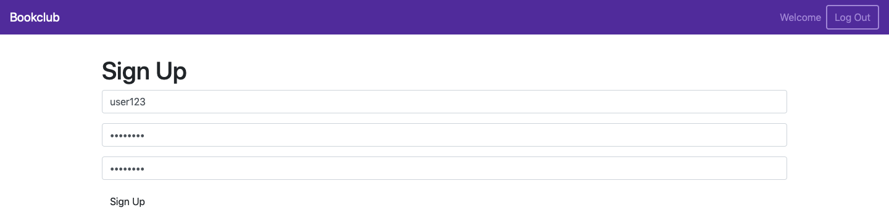
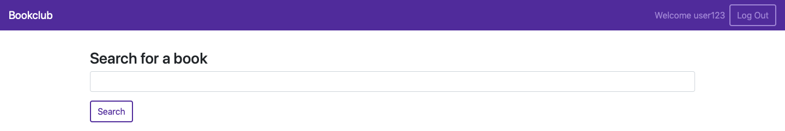
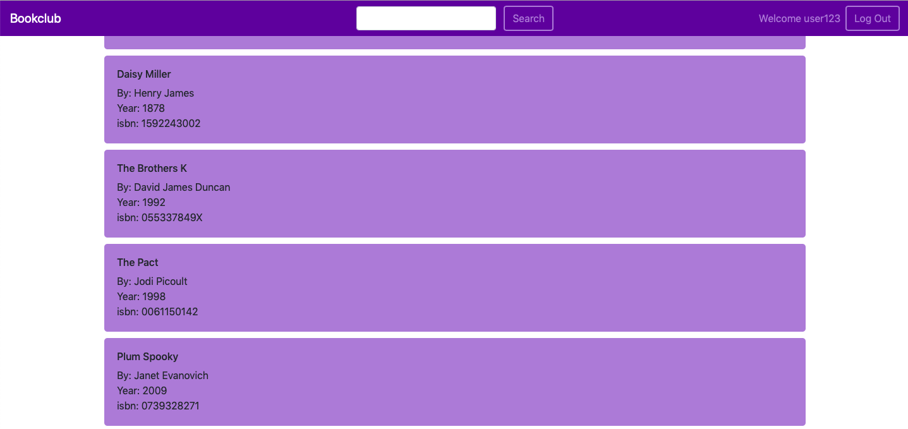
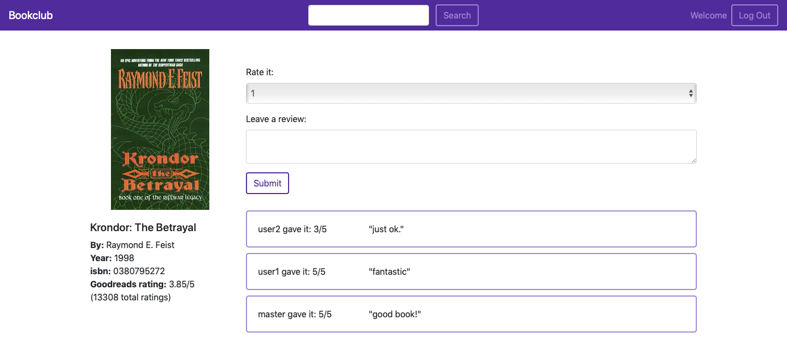

# Project1: Books

## Project Requirements & Getting Started
[Project Documentation](https://docs.cs50.net/web/2018/x/projects/1/project1.html)

## Objectives
* Become more comfortable with Python.
* Gain experience with Flask.
* Learn to use SQL to interact with databases.

## Overview
In this project, you’ll build a book review website. Users will be able to register for your website and then log in using their username and password. Once they log in, they will be able to search for books, leave reviews for individual books, and see the reviews made by other people. You’ll also use the a third-party API by Goodreads, another book review website, to pull in ratings from a broader audience. Finally, users will be able to query for book details and book reviews programmatically via your website’s API.

## Tools Used
* Python
* Flask
* PostgreSQL
* SQLAlchemy
* Heroku
* Goodreads API

## Environment Variables Setup
`export FLASK_APP=application.py`\
`export FLASK_DEBUG=1` - to automatically reload webpage when a change is made\
`export DATABASE_URL=` database URI (under credentials if using Heroku)

## Screenshots

### Login page

### Signup

### Search

### Search

###

