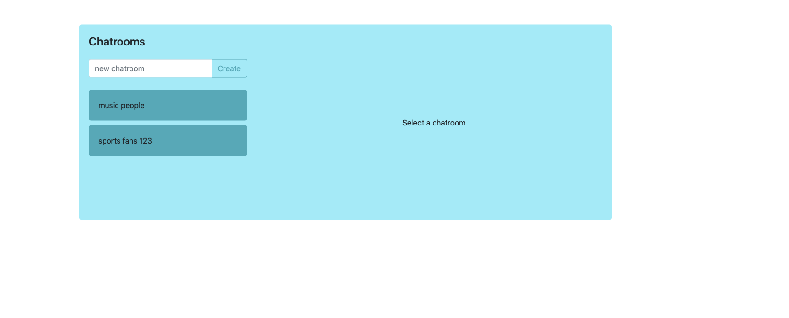
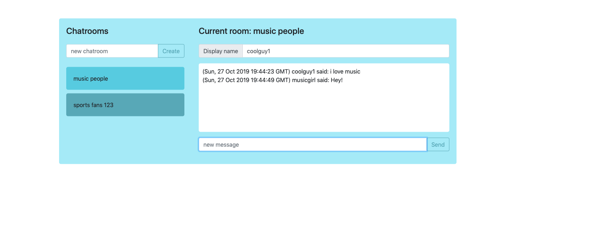

# Project2: Flack

## Project Requirements & Getting Started
[Project Documentation](https://docs.cs50.net/web/2019/x/projects/2/project2.html)

## Objectives
* Learn to use JavaScript to run code server-side.
* Become more comfortable with building web user interfaces.
* Gain experience with Socket.IO to communicate between clients and servers.

## Overview
In this project, you’ll build an online messaging service using Flask, similar in spirit to Slack. Users will be able to sign into your site with a display name, create channels (i.e. chatrooms) to communicate in, as well as see and join existing channels. Once a channel is selected, users will be able to send and receive messages with one another in real time. Finally, you’ll add a personal touch to your chat application of your choosing!

## Tools Used
* Flask
* Socket.IO

## Environment Variables Setup
`export FLASK_APP=application.py`

## Screenshots

### Login page

### Welcome page

### Chat

