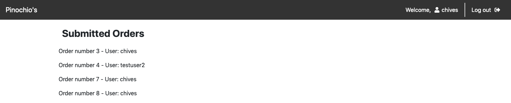

# Project2: Pizza

## Project Requirements & Getting Started
[Project Documentation](https://docs.cs50.net/web/2019/x/projects/3/project3.html)

## Objectives
* Become more comfortable with Django.
* Gain experience with relational database design.

## Overview
In this project, you’ll build an web application for handling a pizza restaurant’s online orders. Users will be able to browse the restaurant’s menu, add items to their cart, and submit their orders. Meanwhile, the restaurant owners will be able to add and update menu items, and view orders that have been placed.

## Tools Used
* Django
* SQLite

## Environment Variables Setup
Run `python manage.py runserver` to start application

## Screenshots

### Login page

### Home page

### Ordering

### Cart

### Orders

